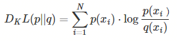
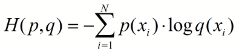
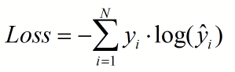

# 机器学习基础知识

[**0. 衡量标准(准确率，召回率)**](#衡量标准)

[**1. 经验参数**](#经验参数)

[**2. 规则**](#规则)

[**3. 概率论与贝叶斯先验**](#概率论与贝叶斯先验)

[**4. 熵、KL散度、交叉熵、互信息**](#熵)

[**5. 生成模型和判别模型的区别**](#生成模型和判别模型的区别)

[**6. gradient descent存在的几个问题**](#gradient_descent存在的几个问题)

[**7. 朴素贝叶斯**](#朴素贝叶斯)

[**8. 树**](#树)


[**10. xgb调参(后期放到建模流程中)**](#xgb调参)

[**11. WOE, IV(information value)来选取离散特征重要性**](#woe_iv选取离散特征重要性)


---

## 衡量标准


## 经验参数


## 规则

 - 有时候用规则效果反而更好，都不需要有设置验证集<br>
 - 找强特征，看分布

## 概率论与贝叶斯先验

(1) 独立和不相关<br>
独立: p(xy) = p(x)p(y), p(A|B) = p(A), E(XY) = E(X)E(Y), Var(X+Y) = Var(X) + Var(Y)<br> 
不相关: 这里的不相关指的是不线性相关 Cov(X, Y)/Var(X)Var(Y)<br>

举例：x在[-1,1]上均匀分布，y = x^2, 这里x和y显然不独立(因为y和x是有联系的)，但是E(xy) - E(x)E(y) = 0，所以x，y不相关。

(2) 商品推荐<br>
商品推荐场景中过于聚焦的商品推荐往往会损害用户的购物体验，在有些场景中，系统会通过一定程度的随机性给用户带来发现的惊喜感。

举例：经计算A和B两个商品与当前访问用户的匹配度分别为0.8分和0.2分，系统将随机为A生成一个均匀分布于0到0.8的最终得分，为B生成一个均匀分布于0到0.2的最终得分，所以B还是有可能推荐给用户的。

(3) 指数分布的无记忆性<br>    
如果一个随机变量呈指数分布，当s，t>=0时有：<br> 
P(x > s + t|x > s) = P(x > t)

(4) 切比雪夫不等式<br>
设随机变量X的期望为μ，方差为σ^2，对于任意正数ε有：<br> 
P{|X-μ|>=ε} <= σ^2/ε^2 <br>
该不等式进一步说明了方差的含义<br> 
该不等式可证明大数定理

(5) 大数定理   

## 熵

 - 熵，又叫信息熵<br>


 - kl散度最常见公式：<br>
<br>
**KL散度 = 交叉熵 - 信息熵**<br>
信息熵就是p*log(p)求和，交叉熵就是p*log(q)求和；一般信息熵是已知的，交叉熵未知(即p已知，q未知)<br>
[链接地址](https://blog.csdn.net/ericcchen/article/details/72357411)

 - 交叉熵公式:<br>
<br>
交叉熵损失函数公式：<br>
<br>
y_true*log(y_pred)求和和kl散度中的交叉熵是一样的p*log(q)<br>
这里的y_true相当于p(已知),y_pred相当于y_pred(求得的预测或近似分布)

 - 互信息 = 信息熵 - 条件熵  I(X,Y)=H(Y)-H(Y|X) <br>
（条件熵的定义：H(Y|X)=H(X,Y)-H(X)）<br>
[链接地址](https://www.cnblogs.com/gatherstars/p/6004075.html)

## 生成模型和判别模型的区别

生成模型有：朴素贝叶斯、HMM等<br>
判别模型有：大部分的分类算法比如lr，svm，gbdt等、最大熵模型、CRF

简单的说，生成模型是从大量的数据中找规律，属于统计学习；需要提供先验概率<br>
而判别模型只关心不同类型的数据的差别，利用差别来分类；没有先验概率

## gradient_descent存在的几个问题

stuck at local minimal <br>
stuck at saddle point <br>
very slow at the plateau

## 朴素贝叶斯

P(θ|x)后验 = P(x|θ)P(θ) / p(x) --> P(x|θ)似然P(θ)先验 <br>  
在贝叶斯概率理论中，如果后验概率P(θ|x)和先验概率P(θ)满足同样的分布律，那么，先验分布和后验分布被叫做共轭分布，同时，先验分布叫做似然函数的共轭先验分布

## 树


## xgb调参
```python
import xgboost as xgb

params = {
        'objective': 'binary:logistic',
        'eta': 0.01,
        'colsample_bytree': 0.887,
        'min_child_weight': 2,
        'max_depth': 10,
        'subsample': 0.886,
        'alpha': 10,
        'gamma': 30,
        'lambda': 50,
        'verbose_eval': True,
        'nthread': 8,
        'eval_metric': 'auc',
        'scale_pos_weight': 10,
        'seed': 201703,
        'missing': -1
        }

 params = {
'colsample_bytree': 0.5041920450812235,
'gamma': 0.690363148214239,
'learning_rate': 0.01,
'max_depth': 8,
'min_child_weight': 9,
'nthread': 1,
'objective': 'binary:logistic',
'reg_alpha': 4.620727573976632,
'reg_lambda': 1.9231173132006631,
'scale_pos_weight': 5,
'seed': 2017,
'subsample': 0.5463188675095159
}

model = xgb.BoostClassifier(加参数即params=)       (这个是sklearn框架)

xgb_m1 = model.fit()

xgb_m1.predict  / xgb_m1.predict_proba

----------------

xgb.train() 这个是xgb的原生态框架

需要将数据 data_t = xgb.DMatrix(X, label=y)

xgb_m2 = xgb.train(params, data_t)

xgb_m2.predict(xgb.DMatrix(test))  这个得到的就是概率【一列 n*1】，而sklean中predict得到的是0和1,predict_proba得到的是概率【两列 n*2，看后面一列>0.5预测为1】

还有个参数evals可以加验证集，early_stopping_rounds=1000 最高迭代1000次，如果验证集误差上升就停止
```

## WOE_IV选取离散特征重要性

注：只针对类别或离散变量，连续性变量可以先进行分箱操作（用R或者python跑DT然后看节点来确定分割点）[IV详解 CSDN](http://blog.csdn.net/kevin7658/article/details/50780391)

## xxx用法
