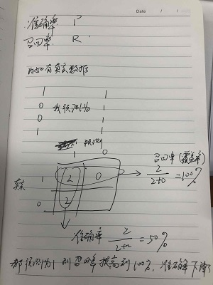

# 机器学习基础知识

[**0. 衡量标准(准确率，召回率)**](#衡量标准)

[**1.经验参数**](#经验参数)

[**2. 规则**](#规则)

[**3.概率论与贝叶斯先验**](#概率论与贝叶斯先验)

[**6. xgb调参(后期放到建模流程中)**](#xgb调参)

[**7. WOE, IV(information value)来选取离散特征重要性**](#woe_iv选取离散特征重要性)


---

## 衡量标准



## 经验参数


## 规则

## 概率论与贝叶斯先验

（1）有时候用规则效果反而更好，都不需要有设置验证集
（2）找强特征，看分布

## xgb调参
```python
import xgboost as xgb

params = {
        'objective': 'binary:logistic',
        'eta': 0.01,
        'colsample_bytree': 0.887,
        'min_child_weight': 2,
        'max_depth': 10,
        'subsample': 0.886,
        'alpha': 10,
        'gamma': 30,
        'lambda': 50,
        'verbose_eval': True,
        'nthread': 8,
        'eval_metric': 'auc',
        'scale_pos_weight': 10,
        'seed': 201703,
        'missing': -1
        }

 params = {
'colsample_bytree': 0.5041920450812235,
'gamma': 0.690363148214239,
'learning_rate': 0.01,
'max_depth': 8,
'min_child_weight': 9,
'nthread': 1,
'objective': 'binary:logistic',
'reg_alpha': 4.620727573976632,
'reg_lambda': 1.9231173132006631,
'scale_pos_weight': 5,
'seed': 2017,
'subsample': 0.5463188675095159
}

model = xgb.BoostClassifier(加参数即params=)       (这个是sklearn框架)

xgb_m1 = model.fit()

xgb_m1.predict  / xgb_m1.predict_proba

----------------

xgb.train() 这个是xgb的原生态框架

需要将数据 data_t = xgb.DMatrix(X, label=y)

xgb_m2 = xgb.train(params, data_t)

xgb_m2.predict(xgb.DMatrix(test))  这个得到的就是概率【一列 n*1】，而sklean中predict得到的是0和1,predict_proba得到的是概率【两列 n*2，看后面一列>0.5预测为1】

还有个参数evals可以加验证集，early_stopping_rounds=1000 最高迭代1000次，如果验证集误差上升就停止
```

## WOE_IV选取离散特征重要性

注：只针对类别或离散变量，连续性变量可以先进行分箱操作（用R或者python跑DT然后看节点来确定分割点）[IV详解 CSDN](http://blog.csdn.net/kevin7658/article/details/50780391)

## xxx用法
