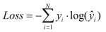
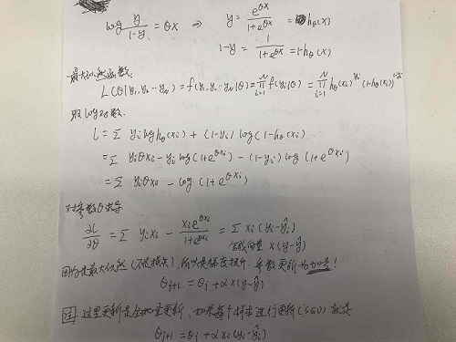

# Basic knowledge for Machine Learning

[**1. 衡量标准(准确率，召回率)**](#衡量标准)

[**2. 经验参数**](#经验参数)

[**3. 规则**](#规则)

[**4. 概率论与贝叶斯先验**](#概率论与贝叶斯先验)

[**5. 熵、KL散度、交叉熵、互信息**](#熵)

[**6. 生成模型和判别模型的区别**](#生成模型和判别模型的区别)

[**7. gradient descent存在的几个问题**](#gradient_descent存在的几个问题)

[**8. 朴素贝叶斯**](#朴素贝叶斯)

[**9. 树**](#树)

[**10. LR(逻辑回归)**](#lr逻辑回归)

[**11. WOE, IV(information value)来选取离散特征重要性**](#woe_iv选取离散特征重要性)

[**12. gbdt原理**](#gbdt原理)

[**13. 二分类问题比赛估计线上01比例**](#二分类问题比赛估计线上01比例)


---

[**CS229 课程讲义中文翻译**](https://kivy-cn.github.io/Stanford-CS-229-CN/#/Markdown/cs229-notes1)

[**机器学习一些基本算法**](https://github.com/binzhouchn/Algorithm_Interview_Notes-Chinese/blob/master/A-%E6%9C%BA%E5%99%A8%E5%AD%A6%E4%B9%A0/A-%E6%9C%BA%E5%99%A8%E5%AD%A6%E4%B9%A0%E7%AE%97%E6%B3%95.md)

[**对机器学习与数据竞赛的一些总结**](https://blog.csdn.net/q383700092/article/details/53842160)

[**打比赛参考链接**]()

https://github.com/wepe 本次比赛主要参考了他们去年微额借款用户人品预测大赛冠军解决方案以及拍拍贷风险控制大赛铜奖解决方案，干货多多！<br>
[金老师的知乎专栏](https://zhuanlan.zhihu.com/jlbookworm)，收录了各种大神解决方案和开源代码。<br>

[**实时更新的数据比赛资料，比赛党福利，选比赛，你少不了他**](https://github.com/iphysresearch/DataSciComp)

[**Kaggle机器学习竞赛冠军及优胜者的源代码汇总**](https://blog.csdn.net/levy_cui/article/details/72831001)

---

## 衡量标准


## 经验参数


## 规则

 - 有时候用规则效果反而更好，都不需要有设置验证集<br>
 - 找强特征，看分布

## 概率论与贝叶斯先验

(1) 独立和不相关<br>
独立: p(xy) = p(x)p(y), p(A|B) = p(A), E(XY) = E(X)E(Y), Var(X+Y) = Var(X) + Var(Y)<br> 
不相关: 这里的不相关指的是不线性相关 Cov(X, Y)/Var(X)Var(Y)<br>

举例：x在[-1,1]上均匀分布，y = x^2, 这里x和y显然不独立(因为y和x是有联系的)，但是E(xy) - E(x)E(y) = 0，所以x，y不相关。

(2) 商品推荐<br>
商品推荐场景中过于聚焦的商品推荐往往会损害用户的购物体验，在有些场景中，系统会通过一定程度的随机性给用户带来发现的惊喜感。

举例：经计算A和B两个商品与当前访问用户的匹配度分别为0.8分和0.2分，系统将随机为A生成一个均匀分布于0到0.8的最终得分，为B生成一个均匀分布于0到0.2的最终得分，所以B还是有可能推荐给用户的。

(3) 指数分布的无记忆性<br>    
如果一个随机变量呈指数分布，当s，t>=0时有：<br> 
P(x > s + t|x > s) = P(x > t)

(4) 切比雪夫不等式<br>
设随机变量X的期望为μ，方差为σ^2，对于任意正数ε有：<br> 
P{|X-μ|>=ε} <= σ^2/ε^2 <br>
该不等式进一步说明了方差的含义<br> 
该不等式可证明大数定理

(5) 大数定理    

## 熵(平均熵)

 - 熵，又叫信息熵<br>


 - kl散度最常见公式：<br>
<br>
**KL散度 = 交叉熵 - 信息熵**<br>
信息熵就是p*log(p)求和，交叉熵就是p*log(q)求和；一般信息熵是已知的，交叉熵未知(即p已知，q未知)<br>
[链接地址](https://blog.csdn.net/ericcchen/article/details/72357411)

 - 交叉熵公式：<br>
<br>
交叉熵损失函数公式：<br>
<br>
y_true*log(y_pred)求和和kl散度中的交叉熵是一样的p*log(q)<br>
这里的y_true相当于p(已知),y_pred相当于y_pred(求得的预测或近似分布)

 - 互信息 = 信息熵 - 条件熵  I(X,Y)=H(Y)-H(Y|X) <br>
（条件熵的定义：H(Y|X)=H(X,Y)-H(X)）<br>
[链接地址](https://www.cnblogs.com/gatherstars/p/6004075.html)

H(XY) = H(X) + H(Y|X)强可加性<br>
如果X,Y独立则H(XY) = H(X) + H(Y)即可加性<br>
H(X|Y) <= H(X)平均熵小于等于，直观的解释就是知道一个条件后进行推测会更加确定所以熵要更小

## 生成模型和判别模型的区别

看interviewQs

## gradient_descent存在的几个问题

stuck at local minimal <br>
stuck at saddle point <br>
very slow at the plateau

## 朴素贝叶斯

P(θ|x)后验 = P(x|θ)P(θ) / p(x) --> P(x|θ)似然P(θ)先验 <br>  
在贝叶斯概率理论中，如果后验概率P(θ|x)和先验概率P(θ)满足同样的分布律，那么，先验分布和后验分布被叫做共轭分布，同时，先验分布叫做似然函数的共轭先验分布

## 树

 - 决策树--信息增益，信息增益比，Gini指数的理解
ID3/C4.5/CART，使用贪心法(**随机森林是局部最优，LR是全局最优所以量纲要一致**)<br>
[链接地址](https://www.cnblogs.com/muzixi/p/6566803.html)

再看interviewQs

## lr逻辑回归

**随机森林是局部最优，LR是全局最优所以量纲要一致**<br>

LR参数更新公式推导:<br>


再看interviewQs

## WOE_IV选取离散特征重要性

注：WOE相当于一种编码，只针对类别或离散变量，连续性变量可以先进行分箱操作
（用ChiMerge或跑gbdt然后看落在哪个叶节点，两种方法均在本人github中，
金融风控->code/scorecardpy；ifeature->add/Binning）<br>
[IV详解 CSDN](http://blog.csdn.net/kevin7658/article/details/50780391)

## gbdt原理

可以说讲得非常清楚<br>
[GBDT原理与Sklearn源码分析-回归篇](https://blog.csdn.net/qq_22238533/article/details/79185969)

## 二分类问题比赛估计线上01比例

提交一个1其他都为0，看auc值<br>
如果auc>0.5，那么说明这个1预测对了，2\*auc-1 = 1/正样本数量<br>
如果auc<0.5，那么说明这个1预测错了，2\*(1-auc)-1 = 1/负样本数量<br>
```python
from sklearn.metrics import roc_auc_score
y_true = [0,0,0,0,0,0,0,0,0,0,0,0,0,0,0,0,0,0,0,0,0,0,0,1,1]
y_pred = [1,0,0,0,0,0,0,0,0,0,0,0,0,0,0,0,0,0,0,0,0,0,0,0,0]
roc_auc_score(y_true, y_pred) #0.478260869565，根据第二个公式得到线上负样本为23个。
```


---

参考学习：

[100-Days-Of-ML-Code](https://github.com/Avik-Jain/100-Days-Of-ML-Code)
