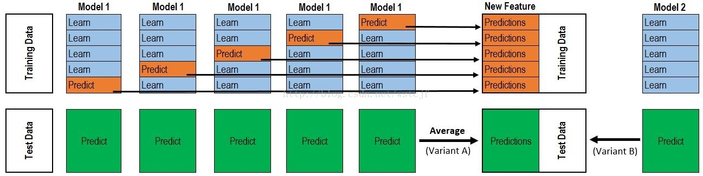

[<h1 align = "center">:helicopter: 模型集成 :running:</h1>][0]

---

### 1. Averaging 和 Voting
- 平均法 对于目标变量为连续值的任务，使用平均
- 投票法
    - 硬投票：每个模型输出它自认为最可能的类别，投票模型从其中选出投票模型数量最多的类别，作为最终分类。
    - 软投票：每个模型输出一个所有类别的概率矢量(1 * n_classes)，投票模型取其加权平均，得到一个最终的概率矢量。

```python
from sklearn.linear_model import LogisticRegression
import xgboost as xgb
from sklearn.ensemble import RandomForestClassifier,VotingClassifier
from lightgbm import LGBMClassifier
log_clf = LogisticRegression(penalty='l1',C=0.1,class_weight='balanced')
xgb_clf = xgb.XGBClassifier(n_jobs = -1)
rf_clf = RandomForestClassifier(n_jobs = -1,n_estimators=200,
                                random_state = 42)             
lgb_clf = LGBMClassifier(num_leaves=127,learning_rate=0.01,n_jobs=32)
# 这里选soft软投票
voting_clf = VotingClassifier (
        estimators = [('xgb', xgb_clf), ('lgb',lgb_clf), ('lt', log_clf), ('rf', rf_clf)],
                     voting='soft', weights = [1, 1, 1, 1.33])
voting_clf.fit(X_train,y_train)
```

在反欺诈中（样本不平衡），标签很多是人工打上去的，他们一般不放过一笔可疑的交易，
所以recall会比较大；如果以f1_score作为衡量标准，几个模型融合的时候，可以取f1_score
最大的几个模型（比如上面代码的xgb,lgb,rf）加上recall最大的模型（上面的lr）

### 2. Stacking

stacking经典图<br>



上图展示了使用5-Fold进行一次Stacking的过程<br>
主要步骤是，比如数据是200个特征，样本数是10万个，
base model经过5折cv(一般业界一折就行)以后得到10万个预测值（即生成一个新特征）<br>
多个基模型就有了多个特征，最后再跑一个meta模型

```python
from sklearn.model_selection import KFold
from sklearn.base import BaseEstimator, TransformerMixin, RegressorMixin, clone
class StackingAveragedModels(BaseEstimator, RegressorMixin, TransformerMixin):
    def __init__(self, base_models, meta_model, n_folds=5):
        self.base_models = base_models
        self.meta_model = meta_model
        self.n_folds = n_folds
   
    # We again fit the data on clones of the original models
    # 三个base model得到的就是三个new features，然后再和y跑一个meta model
    def fit(self, X, y):
        self.base_models_ = [list() for x in self.base_models]
        self.meta_model_ = clone(self.meta_model)
        kfold = KFold(n_splits=self.n_folds, shuffle=True, random_state=156)
        
        # Train cloned base models then create out-of-fold predictions
        # that are needed to train the cloned meta-model
        out_of_fold_predictions = np.zeros((X.shape[0], len(self.base_models)))
        for i, model in enumerate(self.base_models):
            for train_index, holdout_index in kfold.split(X, y):
                instance = clone(model)
                self.base_models_[i].append(instance)
                instance.fit(X[train_index], y[train_index])
                y_pred = instance.predict(X[holdout_index])
                out_of_fold_predictions[holdout_index, i] = y_pred
                
        # Now train the cloned  meta-model using the out-of-fold predictions as new feature
        self.meta_model_.fit(out_of_fold_predictions, y)
        return self
   
    #Do the predictions of all base models on the test data and use the averaged predictions as 
    #meta-features for the final prediction which is done by the meta-model
    def predict(self, X):
        meta_features = np.column_stack([
            np.column_stack([model.predict(X) for model in base_models]).mean(axis=1)
            for base_models in self.base_models_ ])
        return self.meta_model_.predict(meta_features)

# 回归
stacked_averaged_models = StackingAveragedModels(base_models = (ENet, model_xgb, model_lgb),
                                                 meta_model = lasso)
stacked_averaged_models.fit(X.values, y)
```

### 3. Blending

Blending与Stacking类似，但单独留出一部分数据（如20%）用于训练Stage X模型

### 4. Bagging Ensemble Selection

Bagging Ensemble Selection在CrowdFlower搜索相关性比赛中使用的方法，其主要的优点在于可以以优化任意的指标来进行模型集成。
这些指标可以是可导的（如LogLoss等）和不可导的（如正确率，AUC，Quadratic Weighted Kappa等）。它是一个前向贪婪算法，存在过拟合的可能性，
作者在文献中提出了一系列的方法（如Bagging）来降低这种风险，稳定集成模型的性能。使用这个方法，需要有成百上千的基础模型。
为此，在CrowdFlower的比赛中，调参过程中所有的中间模型以及相应的预测结果保留下来，作为基础模型。这样做的好处是，
不仅仅能够找到最优的单模型（Best Single Model），而且所有的中间模型还可以参与模型集成，进一步提升效果。

---
### 5. 多样性
- 误差——分歧分解
- 多样性度量
- 多样性增强
    - 数据样本扰动
    - 输入属性扰动
    - 算法参数扰动
    - 输出表示扰动
        - 翻转法(Flipping Output)：随机改变一些训练样本标记
        - 输出调制法(Output Smearing)：分类输出转化为回归输出
        - OVO/ECOC


---

[0]: http://www.cnblogs.com/jasonfreak/p/5657196.html
