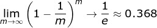

[<h1 align = "center">:helicopter: 集成学习基本策略 :running:</h1>][0]

---

## 1. Bagging（Booststrap AGGregatING）

 - **基于并行策略**：基学习器之间不存在依赖关系，可同时生成
 - **基本思路**
    - 利用`自助采样法`对训练集随机采样，重复进行 T 次；
    - 基于每个采样集训练一个基学习器，并得到 T 个基学习器；
    - 预测时，集体**投票决策****
        > `自助采样法`：对 m 个样本的训练集，有放回的采样 m 次；此时，样本在 m 次采样中始终没被采样的概率约为
         0.368，即每次自助采样只能采样到全部样本的 63% 左右<br>
         
 - **特点**
    - 训练每个基学习器时只使用一部分样本；
    - 偏好`不稳定的学习器`作为基学习器；所谓`不稳定的学习器`，指的是对样本分布较为敏感的学习器。

## 2. Boosting

 - **基于串行策略**
 
基学习器之间存在依赖关系，新的学习器需要根据上一个学习器生成<br>
其主要思想是将弱分类器组装成一个强分类器。在PAC（概率近似正确）学习框架下，则一定可以将弱分类器组装成一个强分类器。

 - **基本思路**
    - 先从初始训练集训练一个基学习器；初始训练集中各样本的权重是相同的；
    - 根据上一个基学习器的表现，调整样本权重，使分类错误的样本得到更多的关注；
    - 基于调整后的样本分布，训练下一个基学习器；
    - 测试时，对各基学习器加权得到最终结果
 
 - **特点**：每次学习都会使用全部训练样本
 - **代表算法**
    - [AdaBoost算法](https://blog.csdn.net/guyuealian/article/details/70995333)
    - [GBDT算法](http://www.jianshu.com/p/005a4e6ac775)
    - xgboost
    - lgb
    - catboost

关于Boosting的两个核心问题：

1. 在每一轮如何改变训练数据的权值或概率分布？

通过提高那些在前一轮被弱分类器分错样例的权值，减小前一轮分对样例的权值，来使得分类器对误分的数据有较好的效果。

2. 通过什么方式来组合弱分类器？

通过加法模型将弱分类器进行线性组合，比如AdaBoost通过加权多数表决的方式（使用加权的投票机制代替平均投票机制），即增大错误率小的分类器的权值，同时减小错误率较大的分类器的权值。而提升树通过拟合残差的方式逐步减小残差，将每一步生成的模型叠加得到最终模型。

## Bagging与Boosting的区别

Bagging和Boosting的区别：

1）样本选择上：

Bagging：训练集是在原始集中有放回选取的，从原始集中选出的各轮训练集之间是独立的。

Boosting：每一轮的训练集不变，只是训练集中每个样例在分类器中的权重发生变化。而权值是根据上一轮的分类结果进行调整。

2）样例权重：

Bagging：使用均匀取样，每个样例的权重相等

Boosting：根据错误率不断调整样例的权值，错误率越大则权重越大。

3）预测函数：

Bagging：所有预测函数的权重相等。

Boosting：每个弱分类器都有相应的权重，对于分类误差小的分类器会有更大的权重。

4）并行计算：

Bagging：各个预测函数可以并行生成

Boosting：各个预测函数只能顺序生成，因为后一个模型参数需要前一轮模型的结果。

## 3. Stacking

 - **基于串行策略**：初级学习器与次级学习器之间存在依赖关系，初学习器的输出作为次级学习器的输入
 - **基本思路**
    - 先从初始训练集训练T个不同的初级学习器；
    - 利用每个初级学习器的输出构建一个次级数据集，该数据集依然使用初始数据集的标签；
    - 根据新的数据集训练次级学习器；
    - 多级学习器的构建过程类似

> 周志华-《机器学习》中没有将 Stacking 方法当作一种集成策略，而是作为一种结合策略，比如加权平均和投票都属于结合策略
 - 为了降低过拟合的风险，一般会利用**交叉验证**的方法使不同的初级学习器在**不完全相同的子集**上训练
 ```
    以 k-折交叉验证为例：
    - 初始训练集 D={(x_i, y_i)} 被划分成 D1, D2, .., Dk；
    - 记 h_t 表示第 t 个学习器，并在除 Dj 外的数据上训练；
    - 当 h_t 训练完毕后，有 z_it = h_t(x_i)；
    - T 个初级学习器在 x_i 上共产生 T 个输出；
    - 这 T 个输出共同构成第 i 个次级训练数据 z_i = (z_i1, z_i2, ..., z_iT)，标签依然为 y_i；
    - 在 T 个初级学习器都训练完毕后，得到次级训练集 D'={(z_i, y_i)}
```

stacking经典图<br>


上图展示了使用5-Fold进行一次Stacking的过程<br>
主要步骤是，比如数据是200个特征，样本数是10万个，
base model经过5折cv(一般业界一折就行)以后得到10万个预测值（即生成一个新特征）<br>
多个基模型就有了多个特征，最后再跑一个meta模型

```python
from sklearn.model_selection import KFold
from sklearn.base import BaseEstimator, TransformerMixin, RegressorMixin, clone
class StackingAveragedModels(BaseEstimator, RegressorMixin, TransformerMixin):
    def __init__(self, base_models, meta_model, n_folds=5):
        self.base_models = base_models
        self.meta_model = meta_model
        self.n_folds = n_folds
   
    # We again fit the data on clones of the original models
    # 三个base model得到的就是三个new features，然后再和y跑一个meta model
    def fit(self, X, y):
        self.base_models_ = [list() for x in self.base_models]
        self.meta_model_ = clone(self.meta_model)
        kfold = KFold(n_splits=self.n_folds, shuffle=True, random_state=156)
        
        # Train cloned base models then create out-of-fold predictions
        # that are needed to train the cloned meta-model
        out_of_fold_predictions = np.zeros((X.shape[0], len(self.base_models)))
        for i, model in enumerate(self.base_models):
            for train_index, holdout_index in kfold.split(X, y):
                instance = clone(model)
                self.base_models_[i].append(instance)
                instance.fit(X[train_index], y[train_index])
                y_pred = instance.predict(X[holdout_index])
                out_of_fold_predictions[holdout_index, i] = y_pred
                
        # Now train the cloned  meta-model using the out-of-fold predictions as new feature
        self.meta_model_.fit(out_of_fold_predictions, y)
        return self
   
    #Do the predictions of all base models on the test data and use the averaged predictions as 
    #meta-features for the final prediction which is done by the meta-model
    def predict(self, X):
        meta_features = np.column_stack([
            np.column_stack([model.predict(X) for model in base_models]).mean(axis=1)
            for base_models in self.base_models_ ])
        return self.meta_model_.predict(meta_features)

# 回归
stacked_averaged_models = StackingAveragedModels(base_models = (ENet, model_xgb, model_lgb),
                                                 meta_model = lasso)
stacked_averaged_models.fit(X.values, y)
```

## 4. Blending

Blending与Stacking类似，但单独留出一部分数据（如20%）用于训练Stage X模型

## 5. Bagging Ensemble Selection

Bagging Ensemble Selection在CrowdFlower搜索相关性比赛中使用的方法，其主要的优点在于可以以优化任意的指标来进行模型集成。
这些指标可以是可导的（如LogLoss等）和不可导的（如正确率，AUC，Quadratic Weighted Kappa等）。它是一个前向贪婪算法，存在过拟合的可能性，
作者在文献中提出了一系列的方法（如Bagging）来降低这种风险，稳定集成模型的性能。使用这个方法，需要有成百上千的基础模型。
为此，在CrowdFlower的比赛中，调参过程中所有的中间模型以及相应的预测结果保留下来，作为基础模型。这样做的好处是，
不仅仅能够找到最优的单模型（Best Single Model），而且所有的中间模型还可以参与模型集成，进一步提升效果。

---
## 6. 多样性
- 误差——分歧分解
- 多样性度量
- 多样性增强
    - 数据样本扰动
    - 输入属性扰动
    - 算法参数扰动
    - 输出表示扰动
        - 翻转法(Flipping Output)：随机改变一些训练样本标记
        - 输出调制法(Output Smearing)：分类输出转化为回归输出
        - OVO/ECOC

## 总结

这两种方法都是把若干个分类器整合为一个分类器的方法，只是整合的方式不一样，最终得到不一样的效果，将不同的分类算法套入到此类算法框架中一定程度上会提高了原单一分类器的分类效果，但是也增大了计算量。

下面是将决策树与这些算法框架进行结合所得到的新的算法：

1）Bagging + 决策树 = 随机森林

2）AdaBoost + 决策树 = 提升树

3）Gradient Boosting + 决策树 = GBDT

[为什么使用决策树作为基学习器](https://github.com/binzhouchn/Algorithm_Interview_Notes-Chinese/blob/master/A-%E6%9C%BA%E5%99%A8%E5%AD%A6%E4%B9%A0/C-%E4%B8%93%E9%A2%98-%E9%9B%86%E6%88%90%E5%AD%A6%E4%B9%A0.md#%E4%B8%BA%E4%BB%80%E4%B9%88%E4%BD%BF%E7%94%A8%E5%86%B3%E7%AD%96%E6%A0%91%E4%BD%9C%E4%B8%BA%E5%9F%BA%E5%AD%A6%E4%B9%A0%E5%99%A8)

---

[0]: http://www.cnblogs.com/jasonfreak/p/5657196.html
